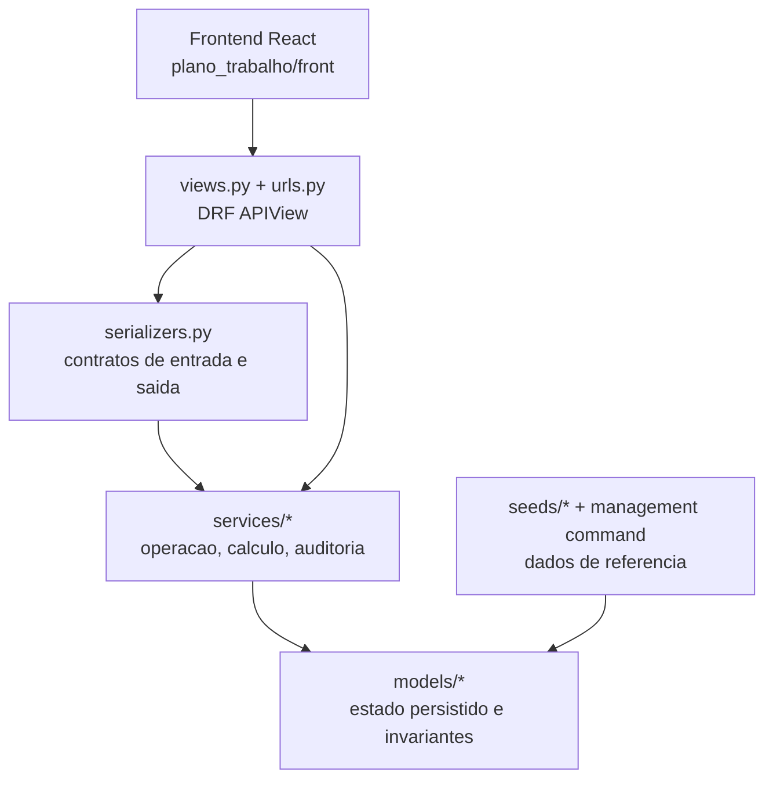

# Arquitetura do app `plano_trabalho`

## Objetivo

O app separa quatro responsabilidades:

1. manter catalogos e bases normativas reutilizaveis;
2. montar um plano operacional com estrutura, escopos e cenarios;
3. calcular quadro, custos, producao, consolidados e cronograma;
4. oferecer uma API estavel para o frontend React.

Essa separacao evita que cada tela precise conhecer todo o dominio. A view recebe a requisicao, o serializer valida o contrato, o service executa a regra de negocio e os models preservam invariantes locais.

## Camadas

## Mapa dos modulos de dominio

| Modulo | Responsabilidade |
| --- | --- |
| `models/base.py` | Bases abstratas, ativacao logica, timestamps e valores tipados. |
| `models/catalogos.py` | Vocabulário canonico: tipos de estrutura, setores, variaveis, rubricas e perfis. |
| `models/salarios.py` | Tabelas salariais versionadas e itens por perfil de alocacao. |
| `models/regras.py` | Conjuntos normativos, composicoes, regras de quadro, regras de rubrica e parametros por cenario. |
| `models/planos.py` | Plano, cenarios, competencias, arvore estrutural, escopos, variaveis e equipe planejada. |
| `models/producao_e_custeio.py` | Procedimentos e componentes de custeio configurados por escopo. |
| `models/resultados.py` | Apuracoes, posicoes, custos apurados, resultados de producao e consolidados. |
| `models/cronogramas.py` | Cronogramas, blocos e parcelas financeiras. |
| `models/auditoria.py` | Proveniencia, log de edicoes e bases vinculadas. |

## Services principais

| Service | Papel |
| --- | --- |
| `frontend.py` | Cria plano inicial, monta arvore, duplica plano, arquiva/reabre/exclui e monta dados de estrutura para o React. |
| `calculo.py` | Resolve cenarios, valida plano, simula, apura, persiste resultados, gera cronograma e fecha plano. |
| `completude.py` | Calcula variaveis exigidas e pendentes por escopo. |
| `regras_aplicaveis.py` | Lista regras aplicaveis a um no/escopo com sugestoes. |
| `aplicar_regras.py` | Materializa sugestoes de quadro em `ItemQuadroEscopo`. |
| `aplicar_regras_rubrica.py` | Materializa componentes de custeio a partir de regras de rubrica. |
| `auditoria.py` | Garante proveniencia, registra eventos e aplica edicao auditada. |
| `bases_vinculadas.py` | Mantem a projecao `PlanoBaseVinculada` sincronizada com as FKs operacionais do plano. |
| `frontend.py` | Tambem resolve assets do bundle Vite ou dev server configurado. |

## Fronteiras importantes

### Views

As views devem:

- autenticar com `IsAuthenticated` ou `LoginRequiredMixin`;
- selecionar o plano, no, cenario ou catalogo correto;
- chamar serializer e service;
- traduzir `ValidationError` em HTTP 400 quando necessario.

Elas nao devem incorporar formulas de calculo, regras de overlay ou logica profunda de duplicacao.

### Serializers

Os serializers devem:

- validar payloads vindos do frontend;
- resolver IDs para models ativos;
- chamar `full_clean()` nos objetos criados ou atualizados quando a model depende de invariantes;
- manter compatibilidade entre aliases de API, como `cenario_id` e `variante_id`.

### Models

Models devem proteger invariantes locais:

- unicidade contextual;
- coerencia entre plano, cenario, escopo e FK;
- limites numericos;
- competencia mensal normalizada;
- escolhas validas de estrategia.

Regras que precisam consultar muitas entidades ou montar saida operacional pertencem a services.

## Cenario como overlay

`VariantePlano` e uma camada de sobrescrita sobre o plano comum.

Para modelos operacionais com `variante_plano`:

- `variante_plano = NULL`: configuracao comum do plano;
- registro ativo no cenario: sobrescreve o comum;
- registro inativo no cenario: bloqueia explicitamente um item herdado;
- `cenario_base`: permite heranca encadeada entre cenarios.

Esse padrao aparece em:

- `ValorVariavelPlano`;
- `ItemQuadroEscopo`;
- `ComponenteCusteioEscopo`;
- `ProcedimentoEscopo`;
- `CalendarioOperacionalEscopo`;
- overrides de bases e parametros globais em `VariantePlano`.

## Bases normativas efetivas

O plano pode usar:

- `conjunto_regras`, quando existe uma base normativa unica;
- `composicao_conjuntos`, quando varias bases precisam ser combinadas em ordem.

Na resolucao de um cenario:

1. parte das bases do plano;
2. percorre a cadeia de cenarios;
3. aplica overrides de conjunto, composicao, tabela salarial e configuracao global;
4. se houver composicao, os conjuntos sao processados na ordem dos itens ativos.

Quando duas regras tecnicamente equivalentes aparecem com o mesmo `codigo`, o motor v1 mantem a primeira e registra a duplicidade na memoria de calculo.

## Frontend

O frontend e uma SPA React em `plano_trabalho/front`.

O shell Django e servido por:

- `/plano-trabalho/`;
- catch-all nao API para rotas internas da SPA.

O bundle pode vir de:

- arquivos Vite compilados em `plano_trabalho/static/plano_trabalho/front`;
- dev server quando `settings.DEBUG` e `PLANO_TRABALHO_VITE_DEV_SERVER` estao configurados.

## Transacoes

Operacoes que criam ou substituem blocos coerentes usam `transaction.atomic()`, especialmente:

- criacao inicial do plano;
- salvamento da configuracao operacional do setor;
- apuracao persistida;
- geracao de cronograma;
- seed canonico;
- substituicao auditada de base.

## Saidas calculadas

O app distingue configuracao de resultado:

- configuracao: plano, cenarios, estrutura, variaveis, quadro, producao e custos;
- resultado: apuracao, posicoes planejadas, custos apurados, consolidados e cronogramas.

Duplicar plano copia configuracao conforme o modo escolhido, mas nao copia apuracoes, cronogramas ou saidas geradas.

## Decisoes que nao devem ser quebradas

- `EscopoPlano` e a unidade de calculo reutilizavel.
- `VariantePlano` deve continuar sendo apresentado como "cenario" para usuario.
- O cronograma nao recalcula regra; ele nasce de `ConsolidadoResultadoMensalEscopo`.
- Catálogos padrao editados por usuario precisam manter proveniencia e auditoria.
- Formulas personalizadas ainda nao sao executadas pelo motor v1.
