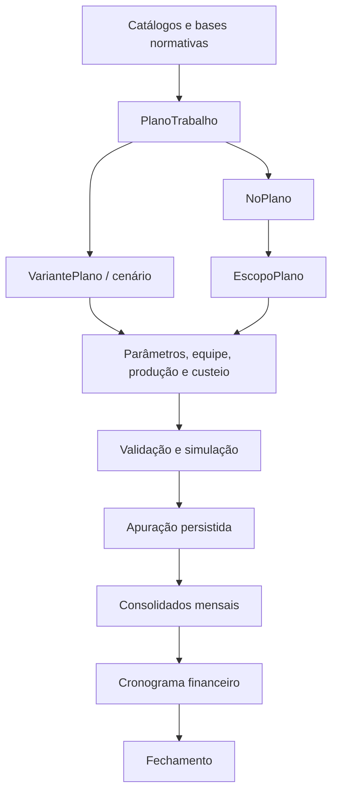

# Documentacao do app `plano_trabalho`

Esta pasta concentra a documentacao funcional e tecnica do app `plano_trabalho`.
Ela deve responder rapidamente a tres perguntas:

- o que o app modela;
- como o fluxo operacional funciona;
- onde alterar models, services, API, frontend e seeds sem quebrar as invariantes do dominio.

## Visao rapida

`plano_trabalho` modela a construcao, simulacao, apuracao, cronograma e fechamento de planos de trabalho para unidades, servicos e recortes assistenciais de saude publica.

No produto, o usuario trabalha com:

1. planos;
2. estrutura de areas;
3. parametros por area;
4. equipes, custeios e regras aplicaveis;
5. cenarios;
6. validacao;
7. simulacao ou apuracao;
8. cronograma financeiro;
9. fechamento, arquivamento ou reabertura.

No codigo, o conceito de **cenario** aparece como `VariantePlano`.

## Mapa da documentacao

| Documento | Quando usar |
| --- | --- |
| [ARQUITETURA.md](./ARQUITETURA.md) | Para entender camadas, fluxo de dados, services principais e decisoes estruturais. |
| [GUIA_OPERACIONAL.md](./GUIA_OPERACIONAL.md) | Para executar o fluxo do app de ponta a ponta, do seed ao fechamento. |
| [API.md](./API.md) | Para integrar ou manter o frontend React e outros consumidores da API. |
| [CALCULO_E_REGRAS.md](./CALCULO_E_REGRAS.md) | Para entender resolucao de cenarios, aplicacao de regras, simulacao, apuracao e cronograma. |
| [AUDITORIA_E_BASES.md](./AUDITORIA_E_BASES.md) | Para entender proveniencia, logs de catalogo e bases vinculadas ao plano. |
| [SEEDS.md](./SEEDS.md) | Para rodar e manter o seed canonico atual. |
| [DESENVOLVIMENTO.md](./DESENVOLVIMENTO.md) | Para rotinas de manutencao, testes, frontend e checklist de mudancas. |
| [models/README.md](./models/README.md) | Para navegar a documentacao detalhada dos models. |

## Entradas principais no codigo

| Camada | Arquivos principais |
| --- | --- |
| URLs e API | `plano_trabalho/urls.py`, `plano_trabalho/views.py`, `plano_trabalho/serializers.py` |
| Models | `plano_trabalho/models/*.py` |
| Calculo e regras | `plano_trabalho/services/calculo.py`, `aplicar_regras.py`, `aplicar_regras_rubrica.py`, `regras_aplicaveis.py` |
| Estrutura para frontend | `plano_trabalho/services/frontend.py`, `completude.py`, `bases_vinculadas.py`, `auditoria.py` |
| Frontend React | `plano_trabalho/front/src/app/*` |
| Seed canonico | `plano_trabalho/management/commands/seed_plano_trabalho.py`, `plano_trabalho/seeds/*` |

## Comando de seed atual

O comando versionado na arvore atual e:

```pwsh
python manage.py seed_plano_trabalho
```

Variantes uteis:

```pwsh
python manage.py seed_plano_trabalho --dry-run
python manage.py seed_plano_trabalho --sem-plano-demo
python manage.py seed_plano_trabalho --somente-validar
python manage.py seed_plano_trabalho --falhar-em-alertas
python manage.py seed_plano_trabalho --data-referencia 2026-01-01
```

Os nomes antigos `seed_realista_rj` e `seed_catalogos_regras_salarios` aparecem em documentos historicos e no comentario do orquestrador, mas nao existem como arquivos de comando na arvore atual.

## Glossario curto

| Termo de produto | Nome tecnico | Observacao |
| --- | --- | --- |
| Plano | `PlanoTrabalho` | Raiz do planejamento. |
| Cenario | `VariantePlano` | Overlay sobre bases, parametros, quadro e custos. |
| Area / estrutura | `NoPlano` | No da arvore operacional do plano. |
| Recorte calculavel | `EscopoPlano` | Unidade que recebe parametros, quadro, custos, resultados e cronograma. |
| Parametro | `ValorVariavelPlano` | Valor tipado associado a uma variavel do catalogo. |
| Equipe | `ItemQuadroEscopo` | Quantidade planejada por `PerfilAlocacao`. |
| Custeio operacional | `ComponenteCusteioEscopo` | Custo mensal, unitario ou percentual informado no escopo. |
| Apuracao | `ApuracaoPlano` | Execucao persistida do motor de calculo. |
| Cronograma | `CronogramaFinanceiro` | Distribuicao temporal derivada dos consolidados mensais. |

## Ciclo de vida do plano

Estados atuais de `PlanoTrabalho`:

- `rascunho`: pode ser editado e excluido.
- `em_andamento`: plano em construcao.
- `validado`: pronto para apuracao ou fechamento conforme regras de negocio.
- `fechado`: resultado final consolidado; cronogramas ativos sao marcados como fechados.
- `arquivado`: plano fora do fluxo ativo; pode ser reaberto.

Regras praticas:

- apenas `rascunho`, `em_andamento` e `validado` sao editaveis;
- `rascunho`, `em_andamento`, `validado` e `fechado` podem ser arquivados;
- apenas `rascunho` pode ser excluido permanentemente;
- plano arquivado pode voltar para `em_andamento`.

## Fluxo de dados



## Principios de manutencao

- Preserve `full_clean()` nos caminhos de escrita que criam ou atualizam models de dominio.
- Prefira alterar services a espalhar regra de negocio em views.
- Trate `VariantePlano` como overlay; `NULL` em `variante_plano` significa configuracao comum.
- Nao duplique saidas de apuracao ou cronograma ao duplicar plano.
- Ao mexer em catalogos editaveis, mantenha proveniencia e auditoria.
- Ao mexer em seed, rode `--dry-run` e `--somente-validar`.
