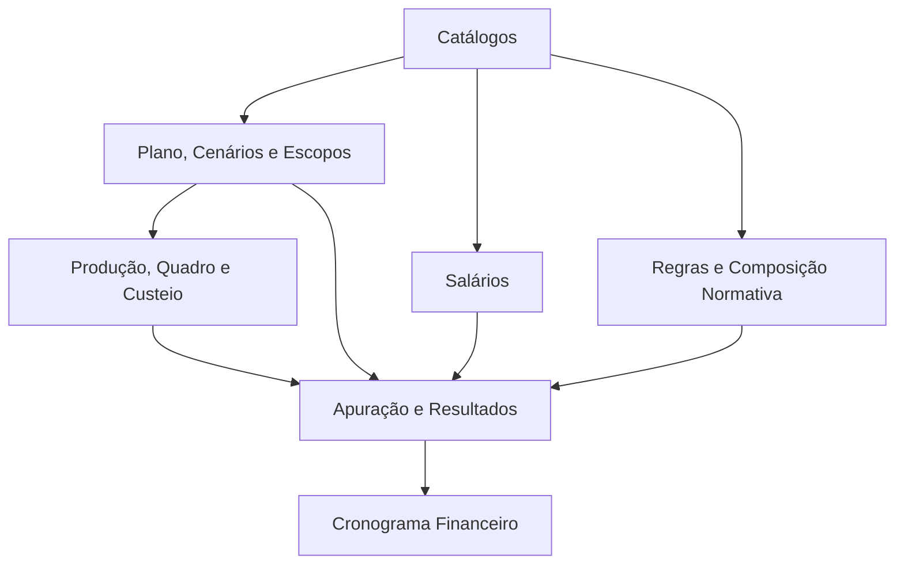
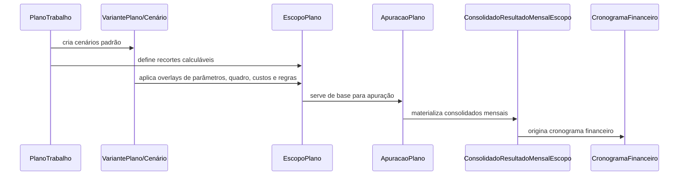

# Visão geral do schema de models

Voltar ao indice de models: [README.md](./README.md)

Guias relacionados:

- [Arquitetura do app](../ARQUITETURA.md)
- [API](../API.md)
- [Calculo e regras](../CALCULO_E_REGRAS.md)
- [Auditoria e bases](../AUDITORIA_E_BASES.md)

## Visão executiva

O app `plano_trabalho` modela a construção de planos de trabalho para unidades e serviços de saúde pública na rede de urgência, emergência e atenção hospitalar.

A experiência de produto deve ser simples:

1. Criar plano.
2. Montar áreas.
3. Configurar cada área.
4. Comparar cenários.
5. Validar.
6. Apurar.
7. Gerar cronograma financeiro.
8. Fechar o plano.

No código, o conceito de produto **cenário** é representado por `VariantePlano`.

## Camadas do domínio

## Fluxo central

## Objetos principais

### Estrutura e cenários

- `ObjetoPlanejamento`
- `PlanoTrabalho`
- `VariantePlano`
- `ConfiguracaoGlobalPlano`
- `ConfiguracaoGlobalVariantePlano`
- `CompetenciaPlano`
- `NoPlano`
- `EscopoPlano`
- `ValorVariavelPlano`
- `ItemQuadroEscopo`

### Referências estáveis

- `TipoNoEstrutura`
- `TipoSetor`
- `CategoriaProfissional`
- `RegimeTrabalho`
- `NaturezaAtuacao`
- `PerfilAlocacao`
- `GrupoRubrica`
- `Rubrica`
- `DefinicaoVariavel`
- `CompatibilidadeTipoSetorVariavel`
- `TabelaSalarial`
- `ItemTabelaSalarial`

### Camada normativa

- `ConjuntoRegras`
- `ComposicaoConjuntoRegras`
- `ItemComposicaoConjuntoRegras`
- `RegraQuadroPessoal`
- `CondicaoRegraQuadroPessoal`
- `FaixaRegraQuadroPessoal`
- `RegraRubrica`
- `CondicaoRegraRubrica`
- `ParametroRubricaVariantePlano`

### Operação e saída

- `ProcedimentoEscopo`
- `ComponenteCusteioEscopo`
- `CalendarioOperacionalEscopo`
- `ApuracaoPlano`
- `PosicaoPlanejada`
- `ResultadoProducaoEscopo`
- `ItemCustoApurado`
- `ItemCustoMensalApurado`
- `ConsolidadoResultadoEscopo`
- `ConsolidadoResultadoMensalEscopo`
- `CronogramaFinanceiro`
- `BlocoCronograma`
- `ParcelaCronograma`

## Princípios de modelagem

### Separar mundo real de instância de cálculo

`ObjetoPlanejamento` representa a entidade real.

`PlanoTrabalho` representa uma leitura operacional e temporal sobre essa entidade.

### Usar cenário como overlay

`VariantePlano` é o cenário. Um cenário pode herdar outro cenário e sobrescrever regras, composição normativa, tabela salarial, parâmetros globais e itens operacionais.

Nos registros operacionais, `variante_plano = null` significa configuração comum do plano. Quando existe registro para um cenário, ele sobrescreve o comum. Registro inativo no cenário bloqueia explicitamente o item herdado.

### Usar `EscopoPlano` como unidade de recorte

O sistema evita repetir combinações de `plano + cenário + nó` em todas as models. Produção, quadro, custos, resultados e cronograma apontam para escopos e registram o cenário quando isso importa.

### Preservar histórico explícito

`ApuracaoPlano` guarda execuções. `CronogramaFinanceiro` materializa uma visão temporal dessas saídas.

## Invariantes que merecem atenção

- `PlanoTrabalho.meses_projecao > 0`.
- `VariantePlano.cenario_base` precisa pertencer ao mesmo plano.
- Só pode haver um cenário padrão por plano.
- `ValorVariavelPlano`, `ItemQuadroEscopo`, `ProcedimentoEscopo`, `ComponenteCusteioEscopo` e `CalendarioOperacionalEscopo` têm unicidade separada para configuração comum e configuração por cenário.
- `FaixaRegraQuadroPessoal` não aceita sobreposição entre faixas da mesma regra.
- Regras de fórmula personalizada não são executadas na v1: se forem obrigatórias, bloqueiam a apuração; se opcionais, geram aviso.
- `ConsolidadoResultadoMensalEscopo` é a base do cronograma financeiro.
- `ParcelaCronograma` só aceita competência mensal do plano e dentro da janela do cronograma.
