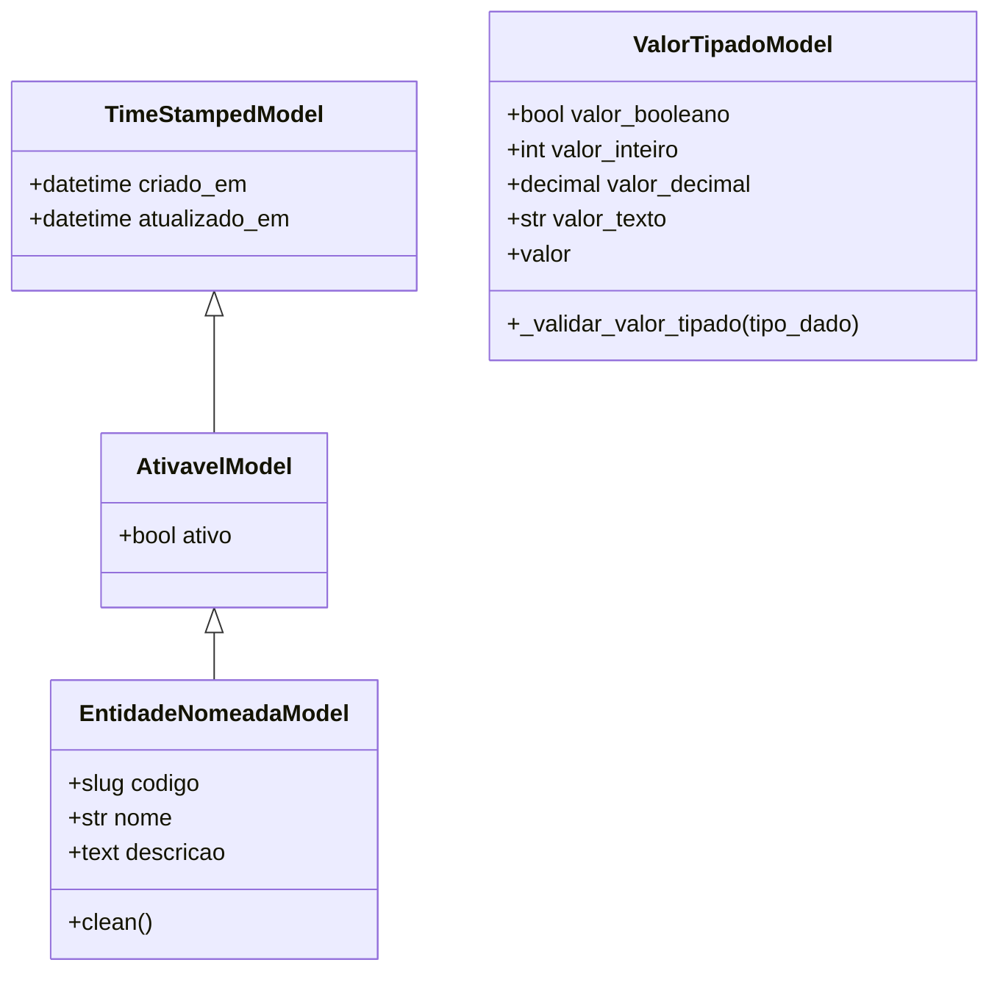

# Módulo `base.py`

## Objetivo do módulo

`base.py` concentra a infraestrutura transversal reutilizada pelos models do app.

Ele resolve três necessidades recorrentes:

- auditoria temporal;
- ativação lógica;
- estruturas comuns de identidade e valor tipado;
- helpers simples para validação consistente de texto e números.

## Componentes do módulo

### Helpers de validação

- `adicionar_erro_texto_vazio()`
- `adicionar_erro_valor_nao_positivo()`
- `adicionar_erro_valor_negativo()`
- `adicionar_erro_valor_maior_que_limite()`

Esses helpers existem para:

- acumular erros antes do `raise ValidationError`;
- evitar `TypeError` em comparações com `None`;
- manter mensagens e padrões de validação mais consistentes entre módulos.

### Classes abstratas

- `TimeStampedModel`
- `AtivavelModel`
- `EntidadeNomeadaModel`
- `ValorTipadoModel`

## Diagrama

## Papel de cada classe

### `TimeStampedModel`

Base mínima de auditoria, com `criado_em` e `atualizado_em`.

### `AtivavelModel`

Adiciona `ativo` para desativação lógica sem exclusão física.

### `EntidadeNomeadaModel`

Centraliza `codigo`, `nome` e `descricao` para entidades com identidade nomeada. Também concentra a validação semântica básica de `codigo` e `nome`.

### `ValorTipadoModel`

Fornece a infraestrutura de armazenamento de um único valor tipado entre:

- booleano;
- inteiro;
- decimal;
- texto.

Essa base é usada principalmente por:

- `ValorVariavelPlano`;
- `CondicaoRegraQuadroPessoal`;
- `CondicaoRegraRubrica`.

## Boas práticas de uso

1. Subclasses sempre devem chamar `super().clean()`.
2. Regras transversais e simples devem preferir helpers deste módulo.
3. `ValorTipadoModel` deve ser usado apenas quando o tipo esperado vier de metadado externo.
4. Lógica de negócio mais complexa continua pertencendo a services ou managers, não a `base.py`.
