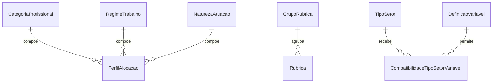

# Módulo `catalogos.py`

## Objetivo do módulo

`catalogos.py` reúne o vocabulário estável do domínio.

Essas models não representam execução de cálculo. Elas descrevem referências reutilizáveis por planos, regras, salários, resultados e cronogramas.

## Classes do módulo

- `TipoNoEstrutura`
- `TipoSetor`
- `CategoriaProfissional`
- `RegimeTrabalho`
- `NaturezaAtuacao`
- `PerfilAlocacao`
- `GrupoRubrica`
- `Rubrica`
- `DefinicaoVariavel`
- `CompatibilidadeTipoSetorVariavel`

## Diagrama

## Papel de cada model

### `TipoNoEstrutura`

Define o papel hierárquico de um nó no plano, incluindo a diretriz `permite_filhos`.

### `TipoSetor`

Define a natureza funcional do nó para parametrização, regra e custeio.

### `CategoriaProfissional`

Catálogo de categorias profissionais.

### `RegimeTrabalho`

Catálogo de jornada e arranjo operacional do posto.

Hoje ele tem invariantes explícitas de integridade:

- cargas horárias semanal e mensal precisam ser positivas;
- a carga mensal não pode ser menor que a semanal;
- `dias_por_semana`, quando informado, deve ficar entre `0` e `7`;
- `horas_por_turno`, quando informada, deve ser positiva e compatível com a carga mensal.

### `NaturezaAtuacao`

Catálogo do papel funcional exercido pelo posto.

### `PerfilAlocacao`

Identidade forte do posto de trabalho planejável, composta por:

- categoria profissional;
- regime de trabalho;
- natureza de atuação.

### `GrupoRubrica`

Agrupador lógico de rubricas financeiras.

### `Rubrica`

Catálogo das rubricas de composição de custo.

### `DefinicaoVariavel`

Dicionário central de variáveis tipadas do sistema, incluindo:

- família lógica;
- tipo de dado;
- unidade de medida;
- granularidade permitida de uso.

### `CompatibilidadeTipoSetorVariavel`

Tabela de compatibilidade entre `TipoSetor` e `DefinicaoVariavel`, usada para dizer quais variáveis fazem sentido em determinado tipo funcional de área.

## Decisões importantes

### `TipoNoEstrutura` e `TipoSetor` são ortogonais

- `TipoNoEstrutura` organiza a árvore.
- `TipoSetor` ativa semântica funcional.

### `PerfilAlocacao` reduz ambiguidade

Salários, regras e resultados dependem do posto completo, não só da profissão.

### Catálogos usam unicidade de forma explícita

Nomes únicos e combinações únicas relevantes ficam documentadas no banco, não apenas no código de aplicação.
