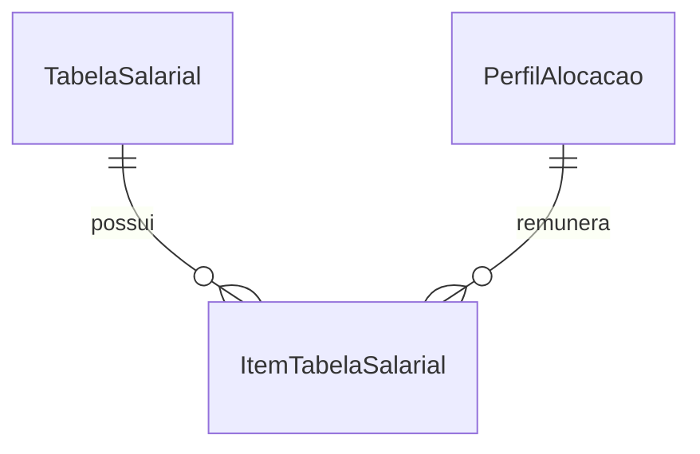

# Módulo `salarios.py`

## Objetivo do módulo

`salarios.py` concentra a referência salarial reutilizada pelos planos.

O módulo existe para manter remuneração como referência versionada, auditável e reaproveitável, separada do resultado apurado.

## Classes

- `TabelaSalarial`
- `ItemTabelaSalarial`

## Diagrama

## Models do módulo

### `TabelaSalarial`

Representa a referência salarial versionada usada por um ou mais planos.

Pontos importantes:

- herda de `EntidadeNomeadaModel`;
- possui `data_referencia` obrigatória;
- mantém identidade estável por `codigo` e `nome`.

### `ItemTabelaSalarial`

Representa o salário base de um `PerfilAlocacao` dentro de uma tabela.

Pontos importantes:

- a combinação `tabela_salarial + perfil_alocacao` é única;
- `salario_base` não pode ser negativo;
- o vínculo é feito com `PerfilAlocacao`, não com `CategoriaProfissional` isolada.

## Decisão central da modelagem

O custo salarial do domínio depende da identidade forte do posto planejável.

Por isso, a referência salarial aponta para `PerfilAlocacao`, preservando distinções entre regime e natureza de atuação que seriam perdidas em uma modelagem baseada apenas na categoria profissional.
