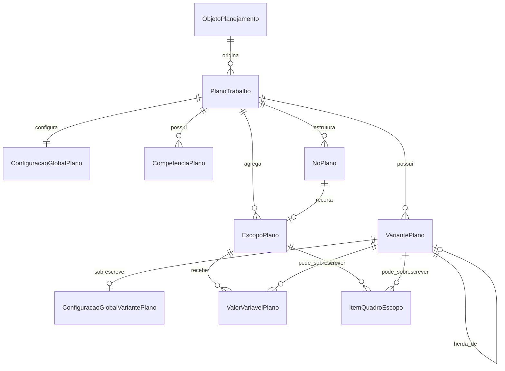

# Módulo `planos.py`

## Objetivo do módulo

`planos.py` concentra o núcleo estrutural do plano: objeto planejado, plano, cenários, competências mensais, árvore de áreas, escopos e configurações operacionais básicas.

No produto, `VariantePlano` deve aparecer para o usuário como **Cenário**.

## Classes

- `ObjetoPlanejamento`
- `PlanoTrabalho`
- `ConfiguracaoGlobalPlano`
- `VariantePlano`
- `ConfiguracaoGlobalVariantePlano`
- `CompetenciaPlano`
- `NoPlano`
- `EscopoPlano`
- `ValorVariavelPlano`
- `ItemQuadroEscopo`

## Diagrama principal

## Papel de cada model

### `ObjetoPlanejamento`

Representa a entidade real que serve de base para o plano, como uma unidade hospitalar, UPA, serviço ou recorte assistencial.

### `PlanoTrabalho`

Representa a instância raiz do planejamento.

Ele referencia:

- `objeto_planejamento`;
- `conjunto_regras` ou `composicao_conjuntos`;
- `tabela_salarial`;
- `data_referencia`;
- `meses_projecao`;
- recorte do objeto, quando não cobre a unidade integral.

Invariantes importantes:

- `meses_projecao > 0`;
- quando o plano não cobre o objeto integralmente, `descricao_recorte` é obrigatória;
- composição normativa, quando informada, tem precedência sobre conjunto único no motor v1.

### `ConfiguracaoGlobalPlano`

Guarda parâmetros globais comuns do plano:

- salário mínimo;
- vale transporte;
- vale refeição;
- vale alimentação;
- percentual CGE;
- percentual RUE-OSC;
- observações.

### `VariantePlano`

Representa um **cenário**.

Cenários padrão criados pela v1:

- `Sem CEBAS`;
- `Com CEBAS`, herdando de `Sem CEBAS`.

Campos de overlay:

- `cenario_base`;
- `conjunto_regras_override`;
- `composicao_conjuntos_override`;
- `tabela_salarial_override`.

Regras:

- só pode haver um cenário padrão por plano;
- o cenário base precisa pertencer ao mesmo plano;
- overrides precisam apontar para bases ativas.

### `ConfiguracaoGlobalVariantePlano`

Guarda overrides globais opcionais de um cenário:

- salário mínimo;
- VT, VR e VA;
- percentual CGE;
- percentual RUE-OSC.

Campo nulo significa "herdar". Campo preenchido significa "sobrescrever".

### `CompetenciaPlano`

Eixo temporal mensal do plano.

A criação inicial gera competências mensais a partir de `data_referencia` e `meses_projecao`.

### `NoPlano`

Representa a árvore operacional do plano.

Pontos importantes:

- valida pertencimento ao mesmo plano;
- protege contra ciclos hierárquicos;
- combina `tipo_no_estrutura` e, opcionalmente, `tipo_setor`;
- quando participa do cálculo, deve possuir `EscopoPlano`.

### `EscopoPlano`

Representa a unidade reutilizável de recorte do cálculo.

Hoje os usos centrais são:

- escopo global do plano;
- escopo de nó/área.

Produção, custeio, resultado e cronograma apontam para `EscopoPlano`.

### `ValorVariavelPlano`

Valor tipado de variável em um escopo.

`variante_plano = null` indica valor comum. Registro com cenário sobrescreve o comum. Registro inativo no cenário bloqueia a herança.

### `ItemQuadroEscopo`

Item de equipe planejada no escopo.

`variante_plano = null` indica quadro comum. Registro com cenário sobrescreve o item pelo mesmo `perfil_alocacao`. Registro inativo no cenário remove explicitamente o item herdado.

## Decisões importantes

### `ponto_partida`

- `zero`: cria esqueleto, cenários padrão, competências e escopo global.
- `base`: além disso, cria uma estrutura inicial mínima quando houver tipo estrutural adequado.
- `modelo` deve ficar escondido até existir template real.

### Duplicação

`duplicar_plano` aceita `modo`:

- `estrutura`: copia árvore, escopos, competências e cenários;
- `configuracao`: copia também parâmetros, quadro, custos, produção, calendário e parâmetros de rubrica.

Apurações, cronogramas e saídas geradas nunca são copiadas.
