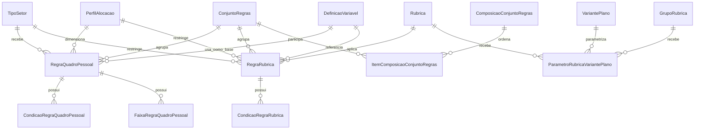

# Módulo `regras.py`

## Objetivo do módulo

`regras.py` concentra a camada normativa do sistema.

Ele organiza:

- conjuntos versionados de regras;
- composição ordenada de conjuntos normativos;
- regras de quadro de pessoal;
- condições de elegibilidade;
- faixas de cálculo;
- regras de rubrica para composição financeira;
- parâmetros de rubrica por cenário.

## Classes

- `ConjuntoRegras`
- `ComposicaoConjuntoRegras`
- `ItemComposicaoConjuntoRegras`
- `RegraQuadroPessoal`
- `CondicaoRegraQuadroPessoal`
- `FaixaRegraQuadroPessoal`
- `RegraRubrica`
- `CondicaoRegraRubrica`
- `ParametroRubricaVariantePlano`

## Diagrama

## Papel de cada model

### `ConjuntoRegras`

Pacote versionado de regras associado ao plano ou a uma composição normativa.

Ponto importante:

- a vigência final não pode ser anterior à vigência inicial.

### `ComposicaoConjuntoRegras`

Agrupa múltiplos `ConjuntoRegras` em ordem de aplicação.

Na v1, quando há duplicidade técnica de regra pelo mesmo `codigo`, vence a primeira regra conforme a ordem da composição. A regra ignorada entra na memória de cálculo como duplicidade técnica.

### `RegraQuadroPessoal`

Regra de dimensionamento de quadro para um `PerfilAlocacao` em um `TipoSetor`.

Estratégias suportadas pela v1:

- proporcional;
- mínimo fixo;
- por faixa;
- fórmula personalizada.

A fórmula personalizada não é executada. Se bloquear uma apuração obrigatória, a v1 retorna erro claro.

### `CondicaoRegraQuadroPessoal`

Condição complementar para elegibilidade ou ativação da regra de quadro.

### `FaixaRegraQuadroPessoal`

Faixa aplicada às regras de quadro do tipo `por_faixa`.

Invariantes:

- `ordem` é única por regra;
- limites e resultado não podem ser negativos;
- faixas da mesma regra não podem se sobrepor.

### `RegraRubrica`

Regra de incidência ou cálculo de rubrica financeira.

Estratégias suportadas pela v1:

- valor fixo;
- percentual sobre base;
- valor por quantidade;
- fórmula personalizada.

Regra de fórmula personalizada:

- obrigatória: bloqueia apuração;
- opcional: é ignorada com aviso.

### `CondicaoRegraRubrica`

Condição complementar para elegibilidade de regra de rubrica.

### `ParametroRubricaVariantePlano`

Permite sobrescrever parâmetros financeiros por cenário, por rubrica ou grupo de rubrica.

Uso esperado:

- cenário `Com CEBAS` pode zerar ou alterar encargos específicos;
- cenário alternativo pode testar percentuais, valores fixos ou condições de custeio.

## Decisões importantes

### O plano aponta para regra coesa

O plano usa `conjunto_regras` quando há apenas uma base normativa. Usa `composicao_conjuntos` quando várias bases precisam ser combinadas.

### O cenário pode trocar a base normativa

`VariantePlano` pode sobrescrever `conjunto_regras` ou `composicao_conjuntos`. Assim, diferentes cenários podem comparar regras distintas sem duplicar o plano inteiro.

### A interface deve esconder tecnicidade

Termos como rubrica, parâmetro e composição normativa devem ficar em áreas avançadas. O fluxo principal deve falar em plano, áreas, cenários, apuração, cronograma e fechamento.
