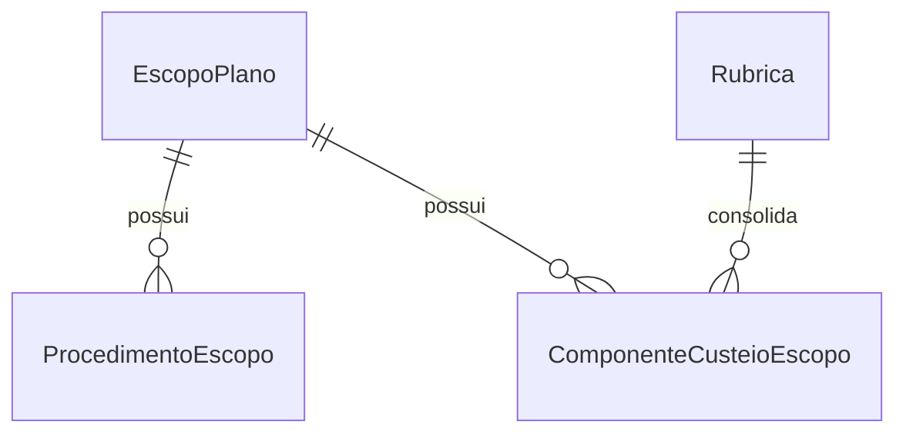

# Módulo `producao_e_custeio.py`

## Objetivo do módulo

`producao_e_custeio.py` reúne insumos operacionais configurados diretamente no escopo.

Ele cobre duas frentes:

- produção esperada ou de referência;
- componentes de custeio que não nascem diretamente da folha de pessoal.

## Classes

- `ItemNomeadoEscopoModel` (abstrata)
- `ProcedimentoEscopo`
- `ComponenteCusteioEscopo`

## Diagrama

## Papel de cada model

### `ItemNomeadoEscopoModel`

Base abstrata local para itens nomeados que pertencem a um `EscopoPlano`.

Ela centraliza:

- `escopo`;
- `codigo`;
- `nome`;
- `descricao`;
- `ordem`.

### `ProcedimentoEscopo`

Representa um item de produção configurado no escopo.

Pontos importantes:

- usa `related_name="procedimentos_escopo"` no reverso do escopo;
- `quantidade_referencia` e `valor_unitario_referencia`, quando informados, não podem ser negativos;
- `codigo` e `nome` são únicos dentro do escopo.

### `ComponenteCusteioEscopo`

Representa um componente de custeio operacional configurado diretamente no escopo.

Estratégias suportadas:

- valor fixo mensal;
- valor unitário por quantidade;
- percentual sobre base.

Pontos importantes:

- usa `related_name="componentes_custeio_escopo"` no reverso do escopo;
- `quantidade_referencia`, `valor_unitario` e `percentual`, quando informados, não podem ser negativos;
- `percentual` não pode ultrapassar `100`;
- `codigo` e `nome` são únicos dentro do escopo;
- a estratégia escolhida determina quais campos precisam ou não estar preenchidos.

## Decisões importantes

### O módulo trabalha sempre em nível de escopo

Produção e custeio complementar são atributos operacionais do recorte do plano, não do plano inteiro por padrão.

### Rubrica em componente é de consolidação

`ComponenteCusteioEscopo.rubrica` funciona como apoio de classificação e consolidação financeira, não como motor completo de regra.
