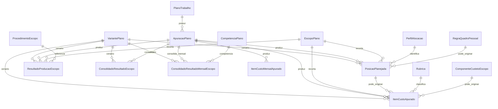

# Módulo `resultados.py`

## Objetivo do módulo

`resultados.py` materializa a saída persistida das apurações do plano.

É o ponto em que estrutura, cenário, regra, salário e insumos operacionais passam a produzir registros concretos de resultado.

## Classes

- `ApuracaoPlano`
- `PosicaoPlanejada`
- `ResultadoProducaoEscopo`
- `ItemCustoApurado`
- `ItemCustoMensalApurado`
- `ConsolidadoResultadoEscopo`
- `ConsolidadoResultadoMensalEscopo`

## Diagrama

## Papel de cada model

### `ApuracaoPlano`

Cabeçalho de uma execução de apuração.

Agrupa:

- tipo de apuração;
- status;
- data de referência;
- cenários processados em `metadados_json`;
- observações e erros.

### `PosicaoPlanejada`

Resultado do dimensionamento de um perfil em um escopo e cenário.

Invariantes importantes:

- para resultado comum: `apuracao + escopo + perfil_alocacao`;
- para resultado por cenário: `apuracao + escopo + variante_plano + perfil_alocacao`;
- quantidades não podem ser negativas;
- quando `regra_quadro_pessoal` é informada, ela deve pertencer a um conjunto normativo efetivo do plano/cenário.

### `ResultadoProducaoEscopo`

Resultado de produção de um procedimento em um escopo e cenário.

Pontos importantes:

- para resultado comum: `apuracao + procedimento_escopo`;
- para resultado por cenário: `apuracao + variante_plano + procedimento_escopo`;
- quantidade e valores de referência não podem ser negativos.

### `ItemCustoApurado`

Saída financeira granular da apuração.

Origens suportadas:

- `rubrica_posicao`;
- `rubrica_escopo`;
- `componente_custeio`.

Pontos importantes:

- a origem define exatamente quais vínculos podem ou devem estar preenchidos;
- itens híbridos são rejeitados;
- posição e componente precisam ser coerentes com a mesma apuração e o mesmo escopo;
- registra o cenário usado.

### `ItemCustoMensalApurado`

Versão mensalizada de um custo apurado.

É criada por competência do plano e considera calendário operacional quando existir.

### `ConsolidadoResultadoEscopo`

Consolidação do escopo em uma apuração e cenário.

Funciona como leitura rápida de totais por escopo.

### `ConsolidadoResultadoMensalEscopo`

Consolidação mensal do escopo em uma apuração e cenário.

É a base direta para geração de `CronogramaFinanceiro`.

## Decisões importantes

### `ApuracaoPlano` preserva histórico

Cada execução gera seu próprio conjunto de saídas, permitindo comparação e auditoria.

### Cálculo v1 é rastreável

O serviço `services/calculo.py` registra memória de cálculo legível nos campos JSON de posições, custos e consolidados.

### Resultado mensal é materializado

O cronograma financeiro não recalcula regra. Ele lê `ConsolidadoResultadoMensalEscopo`.
