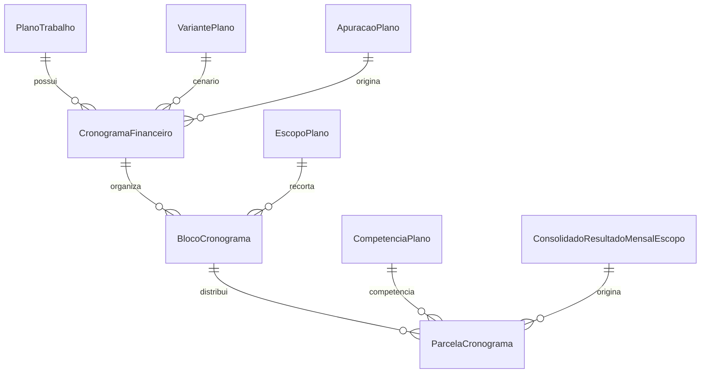

# Módulo `cronogramas.py`

## Objetivo do módulo

`cronogramas.py` materializa a distribuição temporal dos valores consolidados do plano.

Na v1, o cronograma nasce de `ConsolidadoResultadoMensalEscopo`, criado pela apuração.

## Classes

- `CronogramaFinanceiro`
- `BlocoCronograma`
- `ParcelaCronograma`

## Diagrama

## Papel de cada model

### `CronogramaFinanceiro`

Cabeçalho do cronograma do plano.

Pontos importantes:

- pertence a um `PlanoTrabalho`;
- aponta para o `VariantePlano`/cenário;
- aponta para a `ApuracaoPlano` que serviu de base;
- `meses` deve ser maior que zero;
- o fechamento do plano marca cronogramas ativos como fechados.

### `BlocoCronograma`

Agrupa parcelas em blocos financeiros legíveis.

Na geração v1, são criados blocos por escopo e cenário:

- pessoal;
- custeio operacional.

Pontos importantes:

- `codigo` e `nome` são únicos dentro do cronograma;
- pode ser associado a um `EscopoPlano`;
- pode ser associado a um `GrupoRubrica`, quando a evolução futura exigir.

### `ParcelaCronograma`

Materializa o valor mensal previsto de um bloco.

Invariantes importantes:

- existe no máximo uma parcela por `bloco + competencia_plano`;
- a competência precisa pertencer ao plano do cronograma;
- `valor_previsto` não pode ser negativo;
- pode apontar para `ConsolidadoResultadoMensalEscopo`.

## Decisão importante do desenho

O cronograma não tenta ser um motor normativo novo.

Ele é uma saída temporal estruturada, derivada da apuração. Isso mantém o fechamento rastreável e evita divergência entre cálculo e programação financeira.
