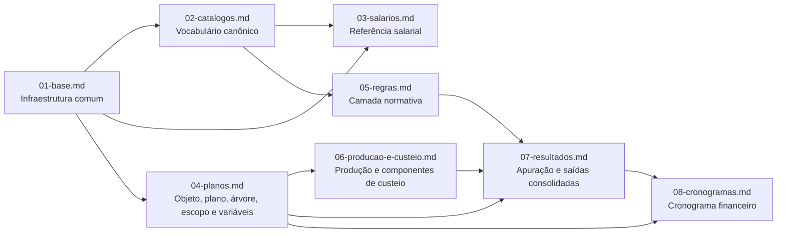

# Models do app `plano_trabalho`

Voltar ao indice geral: [../README.md](../README.md)

## Objetivo

Esta pasta documenta o schema vigente dos models do app `plano_trabalho`.

O foco é explicar:

- quais entidades existem hoje;
- como elas se distribuem por módulo;
- onde começa e termina cada responsabilidade;
- quais invariantes importantes foram endurecidas em `clean()` e no banco.

## Fluxo central do domínio

```text
PlanoTrabalho
  -> EscopoPlano
  -> ApuracaoPlano
  -> CronogramaFinanceiro
  -> BlocoCronograma
  -> ParcelaCronograma
```

Esse fluxo é sustentado por quatro camadas auxiliares:

- `catalogos.py`: vocabulário estável do domínio;
- `salarios.py`: referência salarial por perfil;
- `regras.py`: camada normativa de quadro e rubricas;
- `producao_e_custeio.py`: insumos operacionais por escopo.

## Mapa dos módulos



## Leitura recomendada

### Para entender o domínio pela primeira vez

1. `00-visao-geral.md`
2. `04-planos.md`
3. `02-catalogos.md`
4. `05-regras.md`
5. `07-resultados.md`

### Para trabalhar em integridade de models

1. `01-base.md`
2. `04-planos.md`
3. `05-regras.md`
4. `06-producao-e-custeio.md`
5. `07-resultados.md`
6. `08-cronogramas.md`

### Para trabalhar em cronograma financeiro

1. `04-planos.md`
2. `07-resultados.md`
3. `08-cronogramas.md`

## Invariantes importantes do schema atual

- `TabelaSalarial` herda de `EntidadeNomeadaModel`.
- Faixas de `RegraQuadroPessoal` são mutuamente exclusivas e têm `ordem` única por regra.
- `ParcelaCronograma.competencia` representa sempre o primeiro dia do mês e só pode existir uma parcela por bloco/mês.
- Percentuais de `ComponenteCusteioEscopo` e de `RegraRubrica` não podem ultrapassar `100`.
- `PosicaoPlanejada` e `ItemCustoApurado` validam coerência entre plano, escopo, regra, posição e componente.
- Checks simples e estáveis foram levados para o banco, com índices explícitos nas leituras mais frequentes.

## Arquivos

- [../ARQUITETURA.md](../ARQUITETURA.md)
- [../CALCULO_E_REGRAS.md](../CALCULO_E_REGRAS.md)
- [../AUDITORIA_E_BASES.md](../AUDITORIA_E_BASES.md)
- [00-visao-geral.md](./00-visao-geral.md)
- [01-base.md](./01-base.md)
- [02-catalogos.md](./02-catalogos.md)
- [03-salarios.md](./03-salarios.md)
- [04-planos.md](./04-planos.md)
- [05-regras.md](./05-regras.md)
- [06-producao-e-custeio.md](./06-producao-e-custeio.md)
- [07-resultados.md](./07-resultados.md)
- [08-cronogramas.md](./08-cronogramas.md)
